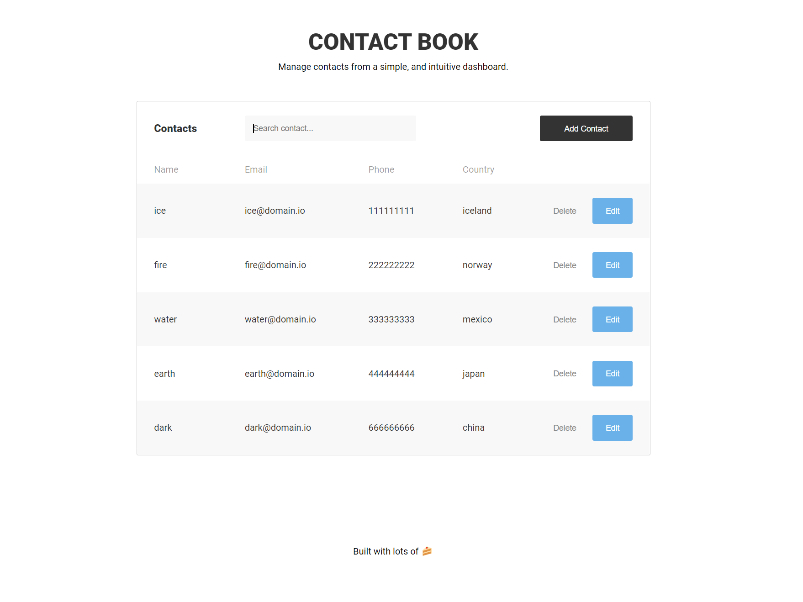

# Contact Book | Vue + Laravel App

## Overview

Full-stack project built with Vue and Laravel.

<p align="center">
  
</p>

## Objective

Build a fullstack application where users can manage a list of contacts.

## Stack

-   **Client side**
    -   Vue
    -   Vue Router
    -   Sass
-   **Server side**
    -   Laravel
-   **Database**
    -   MySQL
-   **Project management tools**
    -   composer, npm, Git

## Features

-   Users can

    -   Create contacts
    -   Edit contacts
    -   Delete Contacts

-   Validation is done on client and server side
-   Responsive layout
-   Database tables created through migration files
    -   Run `php artisan migrate`
-   Database tables populated through Laravel Seeder files
    -   Run `php artisan db:seed`
-   Search bar that queries every field of the list
-   Built with 💚 and Vue

## Testing the Application

### Setup project

Clone repo and install required dependencies

```bash
git clone https://github.com/Mozetsu/contact-book.git

cd contact-book

npm i && composer install
```

Rename **.env.example** file to **.env** in order for Artisan to generate a new project key

`.env.example --> .env`

```bash
php artisan key:generate
```

### Run project locally

Create a MySQL database with XAMPP or other similar service, and set database .env variables in project

```bash
DB_DATABASE=...
DB_USERNAME=...
DB_PASSWORD=...
```

Generate database tables and populate with random data

```bash
php artisan migrate

php artisan db:seed
```

Start Dev server

```bash
php artisan serve
```

Server will run on `http://localhost:8000`

### Run project with Docker

update database .env variables

```bash
DB_HOST=mysql
DB_DATABASE=contact_book
DB_USERNAME=root
```

Instantiate containers

```bash
npm run docker # create containers

npm run migrate # create db tables

npm run seed # populate db tables
```

Server will run on `http://localhost:8000`

## Conclusion

Good challenge. I rate it 10/10 as I had to google a LOT, but still managed to complete everything. Couldn't dive deeper into the frameworks when developing as I had only one week to learn two new technologies, however I feel pretty happy with the overall result.
